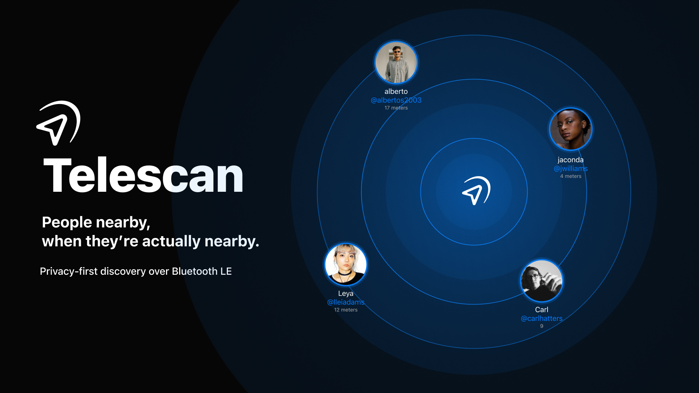

# Telescan

**Last reviewed: August 27, 2026.**

Telescan is an iOS extension for Telegram that helps people nearby exchange the
public Telegram usernames they choose to share. Nearby discovery uses Bluetooth
Low Energy; profiles are loaded only for authenticated Telescan users.

## How it works

1. Authenticate the primary Telescan account with Sign in with Apple.
2. Request a one-time linking code from the Telescan Telegram bot.
3. Enter the code in the iOS app to attach the Telegram profile.
4. Allow Bluetooth access; scanning starts automatically after registration.
5. Open a nearby profile to continue in Telegram, or disable scanning at any
   time to stop advertising the Telescan profile.

## Video demonstration

https://github.com/user-attachments/assets/a3910e7c-c475-40b3-a3c3-43ab5ea79c30

## Privacy at a glance

- Nearby devices exchange a random Telescan profile identifier, not your
  Telegram password, messages, contacts, or phone number.
- Bluetooth signal strength and approximate distance are processed on the
  device and are not sent to Telescan servers.
- The app keeps a device-local list of profiles met during the last 24 hours;
  it contains no GPS data or distance history, is never uploaded, and can be
  cleared at any time.
- Telescan does not request GPS location or maintain server-side movement
  history.
- Your Telescan ID is advertised nearby only while discoverability is enabled;
  an authenticated user who already knows that ID may still request the shared
  profile.
- You can report or block a profile, remove your photo, sign out the current
  device, or delete the Telescan account from the app.
- Telescan contains no advertising or third-party behavioral analytics SDK.

Bluetooth visibility and distance are approximate and may be delayed by iOS.
Telescan must not be used for navigation, safety decisions, emergency response,
or precise proof that a person is physically present.

## Availability

The current client supports iOS 17.6 or newer and requires a Telegram account.
An internet connection is required for account linking, profile loading,
BIO and photo updates, reports, blocks, logout, and account deletion. Nearby
Bluetooth detection alone does not guarantee that a complete profile can be
displayed.

The core application and infrastructure are developed in private repositories.
This public repository contains only product, policy, support, and
security-contact information.

## Policies and project information

- [Privacy Policy](./PRIVACY_POLICY.md)
- [Terms of Service](./TERMS_OF_SERVICE.md)
- [Security Policy](./SECURITY.md)
- [Public Roadmap](./ROADMAP.md)

The current public legal pages are also available at
[tgtelescan.ru/privacy](https://tgtelescan.ru/privacy) and
[tgtelescan.ru/terms](https://tgtelescan.ru/terms).

## Contact

- Developer: [Ruslan Chukavin](https://github.com/r66cha)
- Telegram: [@r_chukavin](https://t.me/r_chukavin)
- Email: [admin@tgtelescan.ru](mailto:admin@tgtelescan.ru)

## License

Copyright © 2021 - 2026 Ruslan Chukavin. All rights reserved. The documentation,
branding, and other materials in this repository are not open source. See
[LICENSE](./LICENSE).
