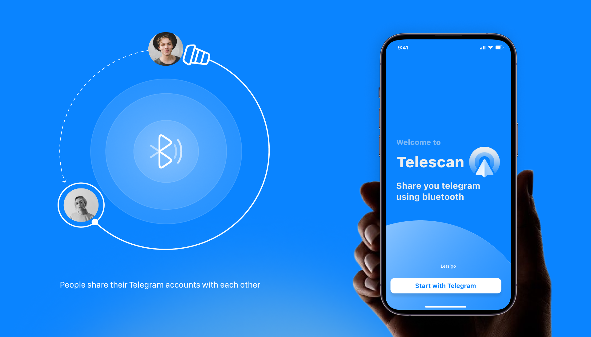
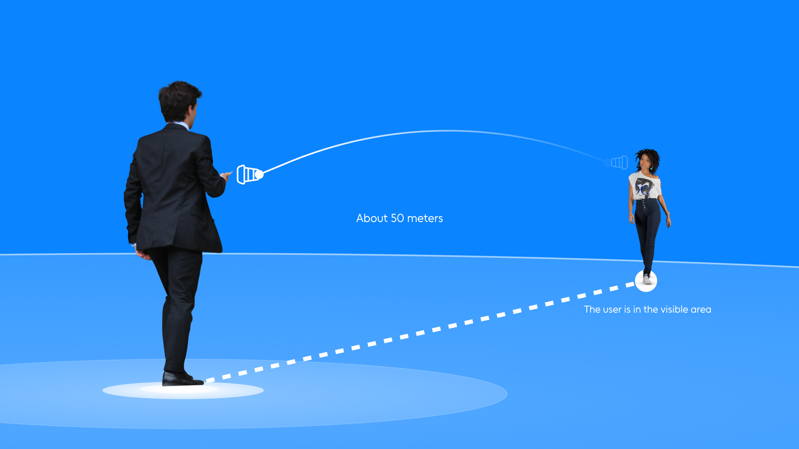
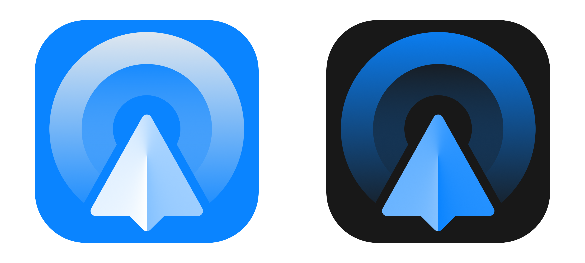

# Telescan

Telescan is a social radar for discovering people nearby. Bluetooth Low Energy
(BLE) performs discovery directly between devices without collecting GPS
coordinates or sending proximity measurements to the server.

Telescan extends Telegram rather than replacing it. A user links a Telegram
profile through the Telescan bot, chooses when to become discoverable, and can
open a nearby person's public profile in Telegram. Registration, authenticated
profile loading, photo management, session management, and account deletion
require internet access.

## How it works

1. Request a short-lived, one-time code from
   [@tgtelescan_bot](https://t.me/tgtelescan_bot).
2. Enter the code in the iOS app. The app creates a per-device session and
   stores its access and rotating refresh tokens in Keychain.
3. Enable discovery. The app advertises a random public `telescan_id`, not a
   Telegram ID or authentication token.
4. Select a nearby device. The app uses its authenticated API session to load
   the shared profile, can open its Telegram username, and offers native report
   and block actions.

## Current architecture

| Project | Responsibility |
| --- | --- |
| [Telescan-iOS](https://github.com/hiTechTeam/Telescan-iOS) | SwiftUI client, Keychain sessions, BLE scanning and advertising |
| [Telescan-bot-app](https://github.com/hiTechTeam/Telescan-bot-app) | Telegram commands, current profile synchronization, and server-side confirmation UI |
| [Telescan-admin-bot](https://github.com/hiTechTeam/Telescan-admin-bot) | Allow-listed Telegram moderation interface for reports |
| [Telescan-api](https://github.com/hiTechTeam/Telescan-api) | Authentication, authorization, profiles, photos, and all application data access |
| [Telescan-db](https://github.com/hiTechTeam/Telescan-db) | MongoDB 8 runtime and encrypted off-host backup automation |
| [Telescan-nginx](https://github.com/hiTechTeam/Telescan-nginx) | TLS termination, renewal automation, and public routing policy |

The API is the sole owner of MongoDB collections and S3-compatible photo
storage. The bot uses a service-authenticated internal API; iOS uses short-lived
JWT access tokens backed by active per-device sessions. Android support is not
implemented.

## Privacy summary

Telescan does not collect GPS location, contacts, Telegram messages,
advertising identifiers, analytics events, or encounter history. RSSI and
approximate distance stay on the iPhone.

The service stores the Telegram account fields needed for the shared profile, a
random `telescan_id`, profile photos, one-time link-code digests, device-session
metadata, temporary server-side confirmation records, user-created blocks, and
moderation reports. Reports contain the selected reason, optional context, and
a snapshot of the reported profile so later profile edits do not erase review
context. Users control discoverability, can manage blocked profiles, sign out
the current device, and permanently delete the Telescan account from the app.
Deleting Telescan does not delete or modify the connected Telegram account.

Production MongoDB is backed up daily to a client-side encrypted off-host
Restic repository. Backups are not part of normal product access and expire
under the documented daily, weekly, and monthly retention policy.

## Production controls

The API, user bot, and admin bot run as unprivileged users in read-only
containers with Linux capabilities dropped. Public nginx exposes only the
supported API and legal routes, keeps Swagger behind an SSH tunnel, and renews
certificates automatically. The seven repositories protect `main` with pull
requests and enable secret scanning with push protection, vulnerability alerts,
and Dependabot security updates. iOS additionally requires its `Build and test`
GitHub Actions check before merge.

## Documentation

- [Whitepaper](./WHITEPAPER.md) — implemented product and technical design
- [Privacy Policy](./PRIVACY_POLICY.md) — processed data, retention, and deletion
- [Terms of Service](./TERMS_OF_SERVICE.md) — service rules and limitations
- [Security Policy](./SECURITY.md) — security model and vulnerability reporting
- [Roadmap](./ROADMAP.md) — completed foundations and planned work
- [Known Issues](./KNOWN_ISSUES.md) — current limitations and troubleshooting

Public legal pages are served at
[tgtelescan.ru/privacy](https://tgtelescan.ru/privacy) and
[tgtelescan.ru/terms](https://tgtelescan.ru/terms).

## License and contact

Telescan source code is available under the [MIT License](./LICENSE).
Contact [r66cha](https://github.com/r66cha) via
[Telegram](https://t.me/r_chukavin) or
[email](mailto:r66cha@gmail.com).
