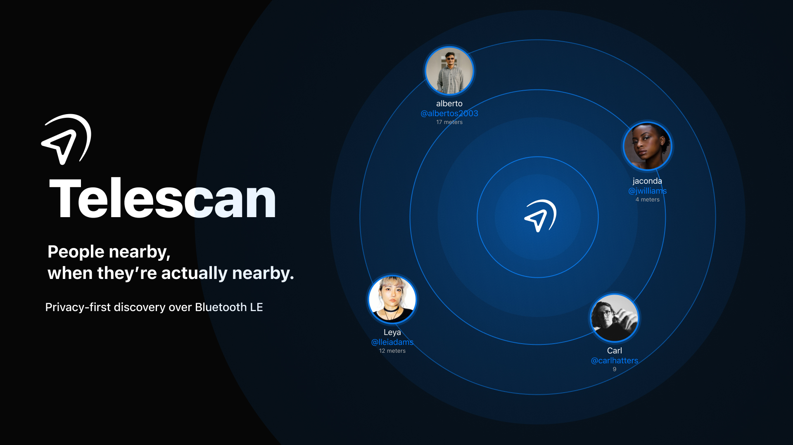

# Telescan

Telescan is a serverless iOS app for finding people nearby and exchanging
user-created profiles directly between iPhones using Bluetooth Low Energy.

## How it works

1. Create a local profile with a photo, name, Telegram username and optional
   description.
2. Allow Bluetooth access and enable scanning.
3. View people nearby, save profiles you want to remember or open a shared
   username in Telegram.

No Telescan account is required. Nearby discovery and profile exchange work
directly between devices without a Telescan backend. Profiles, **Met** history,
**Saved** profiles and blocks are stored locally.

Telescan does not read Telegram messages or contacts and does not use GPS. A
Telegram username is entered by the user and is not verified by Telescan.
Nearby users may save information you share. Bluetooth discovery and distance
estimates are approximate and must not be used for navigation or safety.

Requires iOS 16.0+ and Bluetooth. Internet access is needed only when opening a
Telegram profile, which is handed off to Telegram or a web browser.

## По-русски

Telescan — serverless-приложение для iOS, которое помогает находить людей
рядом и напрямую обмениваться созданными пользователями профилями через
Bluetooth Low Energy.

Пользователь добавляет фотографию, имя, username Telegram и необязательное
описание. Аккаунт Telescan не требуется: поиск рядом и обмен профилями работают
напрямую между устройствами без сервера Telescan. Профили, история
**«Виделись»**, **«Сохранённые»** и блокировки хранятся локально.

Telescan не читает сообщения или контакты Telegram и не использует GPS.
Username вводится самим пользователем и не проверяется Telescan. Люди рядом
могут сохранить переданные им данные. Поиск и оценка расстояния по Bluetooth
приблизительны и не предназначены для навигации или обеспечения безопасности.

Требуются iOS 16.0+ и Bluetooth. Интернет нужен только при открытии профиля
Telegram — ссылка передаётся приложению Telegram или браузеру.

## Policies

- [Privacy Policy](./PRIVACY_POLICY.md) · [Русский](./PRIVACY_POLICY.ru.md)
- [Terms of Service](./TERMS_OF_SERVICE.md) · [Русский](./TERMS_OF_SERVICE.ru.md)
- [Security Policy](./SECURITY.md)
- [Public Roadmap](./ROADMAP.md)

Current legal pages: [Privacy](https://tgtelescan.ru/privacy) and
[Terms](https://tgtelescan.ru/terms).

Contact: [@r_chukavin](https://t.me/r_chukavin) ·
[admin@tgtelescan.ru](mailto:admin@tgtelescan.ru)

## License

Copyright © 2021–2026 Ruslan Chukavin. See [LICENSE](./LICENSE).
