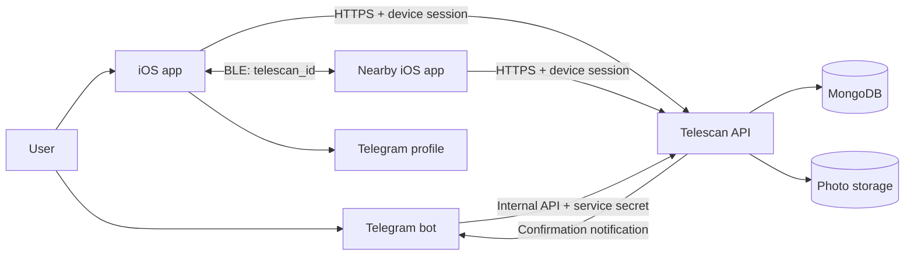
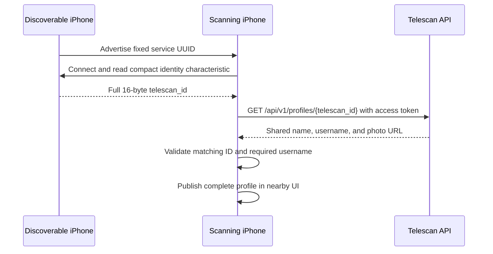

# Telescan Whitepaper

## Purpose and scope

Telescan connects nearby people through the public Telegram profiles they
choose to share. Bluetooth Low Energy (BLE) performs local discovery, while a
small authenticated backend manages accounts, sessions, profiles, and photos.

The current product scope is intentionally narrow: link an account through a
Telegram bot, enable discovery in the iOS app, see nearby Telescan identities,
load their shared profiles, and open a selected Telegram username. Telescan has
no chat, GPS tracking, encounter history, analytics, or advertising system.

## System architecture

Telescan is split across independent repositories with explicit ownership
boundaries:

- **iOS app:** registration, Keychain-backed device sessions, BLE scanning and
  advertising, approximate distance, profile display, photo management, logout,
  and account deletion.
- **Telegram bot:** Telegram commands, current profile-data forwarding, display
  of one-time codes, and server-side confirmation messages.
- **API:** the only application service that reads or writes MongoDB and
  S3-compatible photo storage.
- **Database repository:** MongoDB 8 runtime configuration only.
- **nginx:** TLS termination and public routing policy.

The bot and iOS app never receive MongoDB or S3 credentials.

## Registration, identity, and sessions

The bot reads the user's current Telegram ID, first name, username, and first
available profile photo for every new code. It forwards those fields and an
explicit photo state to the authenticated `/internal/v1` contract. The API
upserts the account, removes an obsolete photo when Telegram reports none, and
assigns a random, stable UUID called `telescan_id`. Failed photo downloads
preserve the existing photo; successful replacements use unique object URLs.

The API generates an eight-character code from uppercase letters and digits.
It stores an HMAC-SHA-256 digest, revokes any earlier unused code for that user,
and returns the clear code to the bot. The default validity period is ten
minutes. Code consumption is atomic, records the installation `device_id`, and
can succeed only once.

The iOS app sends the clear code and a random installation UUID directly to the
API. On success, the API creates or replaces that device's session and returns:

- an HS256 access JWT, normally valid for 15 minutes;
- a random refresh token, normally valid for 30 days;
- the account's public profile and `telescan_id`.

Only a SHA-256 digest of the refresh token is stored. Refresh rotates the token
atomically; reuse of a previous refresh token revokes the affected session.
Every protected endpoint validates the JWT and confirms that its session is
still active, making revocation immediate.

The iOS Keychain stores access and refresh tokens plus the installation
`device_id`. The clear link code is cleared after the linking attempt and is not
persisted. Public profile metadata and discovery preferences may be stored in
`UserDefaults`.

## Session validation, logout, and account deletion

The current iOS MVP presents one account-actions alert with current-device
logout, account deletion, and cancellation. Each destructive choice opens its
own system confirmation. Current-device logout revokes one `DeviceSession` and
clears local account data and caches.

At launch and foreground activation, iOS requests `/api/v1/users/me`. A valid
response refreshes cached Telegram profile fields. A definitively invalid
session or missing current account clears local data; transport failures, rate
limits, malformed gateway responses, and `5xx` errors during validation or
token refresh preserve tokens, cached profile fields, and the cached photo. A
newly linked session clears local photo and HTTP caches before storing the fresh
profile.

The API and bot retain the two-channel logout-all confirmation contract for
compatibility, but the current iOS app does not expose or poll that flow. A
future multi-device logout UI should use reliable push delivery rather than
continuous client polling.

Account deletion is separate from logout. The API revokes sessions first, then
removes owned photos, link codes, confirmation requests, device sessions, and
the user record. Local tokens, profile metadata, BLE state, stored images, and
caches are cleared only after the server confirms deletion.

## BLE discovery protocol

Each discoverable iPhone publishes a custom primary GATT service:

| Item | Value |
| --- | --- |
| Service UUID | `A6B50001-8A5D-4F7A-9E4C-123456789001` |
| Compact identity characteristic | `A6B50003-8A5D-4F7A-9E4C-123456789003` |
| Compact identity value | Full `telescan_id` UUID encoded as 16 lossless bytes |
| Compatibility characteristic | `A6B50002-8A5D-4F7A-9E4C-123456789002` |
| Compatibility value | Lowercase `telescan_id` UUID encoded as UTF-8 |
| Characteristic access | Readable |

Only the fixed service UUID is advertised. The `telescan_id` is never placed in
the size-constrained advertisement local name. A scanner connects, reads the
compact characteristic, and caches the peripheral-to-identity mapping. The
text characteristic allows staged interoperability with the preceding iOS
release. Cached mappings are periodically revalidated and discarded after
repeated GATT failures.

Duplicate advertisements update RSSI and presence without reconnecting on each
packet. A device expires after 10 seconds without a foreground sighting, with a
45-second background grace period for iOS scheduling. A raw BLE candidate is
never rendered: the app first obtains a matching API profile with a non-empty
Telegram username, retries transient failures with bounded exponential backoff,
and cancels resolution when presence is lost. CoreBluetooth state-restoration
identifiers are configured, but iOS still controls background scheduling, so
continuous discovery is not guaranteed.

The random BLE identifier reduces direct exposure of the Telegram numeric ID,
but it is still a stable public pseudonym that nearby observers can capture,
replay, or correlate until the Telescan account is deleted.

## API surface and authorization

| Area | Paths | Credential |
| --- | --- | --- |
| Link and refresh | `/api/v1/auth/link`, `/api/v1/auth/refresh` | One-time code or refresh token |
| Session management | `/api/v1/auth/session`; retained `/api/v1/auth/logout-all/request` compatibility flow | Active access JWT and session |
| Own account | `/api/v1/users/me`, `/api/v1/users/me/photo` | Active access JWT and session |
| Nearby profiles | `/api/v1/profiles/{telescan_id}` | Active access JWT and session |
| Bot operations | `/internal/v1/...` | Shared bot service Bearer secret |
| Legal pages | `/privacy`, `/terms` | Public |

Legacy `/v1` endpoints exist only behind the `ENABLE_LEGACY_API` migration
flag and are hidden from OpenAPI. Public nginx blocks `/internal/`, `/docs`,
`/docs/`, `/redoc`, and `/openapi.json` with `404`. Swagger remains available
only through the API's `127.0.0.1:8000` binding and an SSH tunnel.

## Server-side data model

MongoDB currently contains:

- `users`: random `telescan_id`, Telegram ID, name, username, photo URL, and
  timestamps;
- `link_codes`: HMAC digest, owner, status, expiry, consumption metadata, and
  an attempt counter updated on successful atomic consumption;
- `device_sessions`: installation ID, refresh-token digest, expiry, activity,
  and revocation metadata;
- `confirmation_requests`: public request ID, action, status, expiry, and
  temporary Telegram chat/message IDs.

Link codes, sessions, and confirmations have TTL indexes. MongoDB TTL cleanup is
asynchronous, so an expired document may remain stored briefly after it is no
longer accepted by application logic. Profile objects use the
`users/{telescan_id}/...` prefix in S3-compatible storage.

## Distance estimation

RSSI is converted into a coarse distance estimate using the log-distance model:

`distance = 10 ^ ((TX - RSSI) / (10 × n))`

The current defaults are `TX = -59 dBm` at one metre and path-loss exponent
`n = 2`. The app keeps up to 30 samples for each visible identity, uses the
median, and updates displayed distance every three seconds. The result is a
relative proximity hint, not a physical measurement or safety boundary.

## Privacy and security boundaries

Implemented protections include one-time HMAC-protected link codes,
Keychain-backed client tokens, rotating refresh tokens, per-request session
validation, authenticated own-account mutations, a service credential for bot
traffic, explicit production secrets, TLS, and public proxy denial of internal
and documentation routes.

Current limitations remain:

- any authenticated Telescan account that knows a valid `telescan_id` can query
  that shared profile; the API does not prove physical proximity;
- BLE identifiers and RSSI can be observed, replayed, or manipulated;
- the rate limiter is process-local and resets on restart;
- the bot service credential is a shared long-lived secret;
- remote multi-device logout is not exposed by the current iOS MVP;
- background BLE behavior is controlled by iOS;
- the legacy API must remain disabled except during the controlled migration
  window.

Telescan should be understood as public-profile discovery, not anonymity,
mutual identity proof, precise ranging, or end-to-end encryption.

## Verification status

The current repositories include automated API authentication/deletion tests,
bot service and confirmation tests, iOS token-refresh concurrency tests, BLE
manager tests, Compose validation, Python linting/formatting/type checks, and
Debug/Release iOS builds. Physical-device BLE, production MongoDB/S3 migration,
certificate renewal, backup/restore, and full deployment verification remain
operational checks.

This document describes the implementation on August 15, 2026. Source code is
licensed under the [MIT License](./LICENSE).
