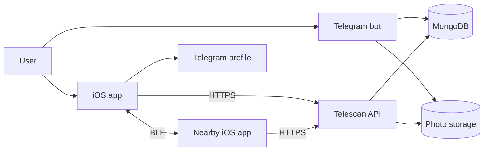
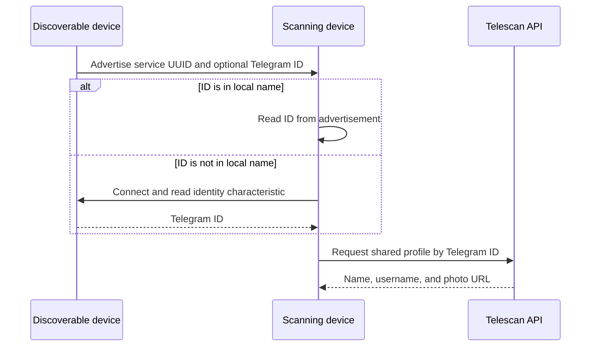

# Telescan Whitepaper

## Purpose

Telescan is a proximity-discovery system that connects nearby people through the public Telegram profiles they choose to share. Bluetooth Low Energy (BLE) provides local discovery, while a small backend stores account profiles and photos.

The current implementation is intentionally narrow: register through a Telegram bot, enable discovery in the iOS app, see nearby Telescan users, and open a selected profile in Telegram. Telescan does not provide its own chat, location history, or encounter analytics.

## System architecture

Telescan is split across independent repositories:

- **Telegram bot:** creates accounts, copies basic public Telegram profile data, generates authentication codes, and updates codes.
- **iOS app:** handles registration, BLE scanning and advertising, approximate distance, profile display, photo management, and account deletion.
- **API:** reads profiles, changes photos, and deletes accounts.
- **MongoDB:** stores Telegram ID, first name, username, authentication-code hash, and photo URL.
- **S3-compatible storage:** stores profile-photo objects.
- **nginx:** terminates HTTPS and forwards requests to the API.

## Registration and profiles

The Telegram bot reads the user's Telegram ID, first name, username, and current public profile photo. It generates an eight-character code from uppercase letters and digits, stores the SHA-256 hash, and shows the original code to the user.

The user enters that code manually in the iOS app. The app hashes it and requests the matching profile from the API. After confirmation, the app stores its own profile, Telegram ID, original code, photo URL, and discovery settings locally in `UserDefaults`; a local profile image may also be stored in the app's documents directory.

The bot can replace the stored hash with a newly generated code. The old code then stops matching the account. There is currently no deep-link registration flow and no expiring server session.

## BLE discovery protocol

Each discoverable device publishes a custom primary GATT service:

| Item | Value |
| --- | --- |
| Service UUID | `A6B50001-8A5D-4F7A-9E4C-123456789001` |
| Identity characteristic | `A6B50002-8A5D-4F7A-9E4C-123456789002` |
| Identity value | Telegram ID encoded as UTF-8 |
| Characteristic access | Readable |

The app advertises the service UUID and, when iOS permits, places the Telegram ID in the advertisement local name. A scanning device filters for the service UUID. If the local name contains an identity, it can be used immediately; otherwise the scanner connects, discovers the service and characteristic, and reads the identity.

The scanner accepts duplicate advertisements so signal strength can be updated. A device is removed after it has not been seen for 20 seconds. CoreBluetooth state-restoration identifiers are configured, but iOS ultimately controls background scanning and advertising; continuous background discovery is not guaranteed.

The Telegram ID is not encrypted at the BLE layer and can be observed by nearby devices. The protocol provides discovery, not proof of identity or proximity.

## API surface

The current API exposes these profile operations:

| Method and path | Purpose | Credential check |
| --- | --- | --- |
| `GET /v1/code/` | Find a profile by authentication-code hash | Matching hash |
| `GET /v1/users/` | Find a shared profile by Telegram ID | None |
| `POST /v1/users/upload-photo` | Upload a profile photo | Telegram ID only |
| `POST /v1/users/update-photo` | Replace or remove a profile photo | Telegram ID only |
| `DELETE /v1/users/` | Delete account, photos, and stored profile | Telegram ID and code hash |

Responses contain only the profile fields required by the app. nginx serves the API over TLS 1.2 or TLS 1.3. API-level rate limiting and token-based sessions are not currently implemented.

## Data lifecycle

The server account record exists until the user deletes the account. The service keeps the current Telegram profile fields, authentication-code hash, and profile-photo URL. Profile photos are stored as S3-compatible objects.

Nearby profile data is loaded only after a device is discovered and is held in the app while that device remains visible. The app does not send RSSI, estimated distance, GPS coordinates, or an encounter history to the server. Standard HTTP access metadata may be processed by the deployed web infrastructure.

Account deletion follows this order:

1. The iOS app sends the Telegram ID and hash of the locally stored code.
2. The API compares the hash with the account record.
3. The API removes the legacy photo object, current photo, and all objects under the user's photo prefix.
4. After storage cleanup succeeds, the API deletes the MongoDB record.
5. The app stops BLE activity and clears its profile, image files, `UserDefaults`, and caches.

If remote photo cleanup fails, the database record remains so deletion can be retried instead of silently leaving inaccessible account data behind.

## Distance estimation

Telescan converts RSSI into a coarse distance estimate using a log-distance path-loss model:

`distance = 10 ^ ((TX - RSSI) / (10 × n))`

The current defaults are `TX = -59 dBm` at one metre and path-loss exponent `n = 2`. The app collects up to 30 RSSI samples per visible device, uses the median to reduce spikes, and recalculates displayed distance every three seconds. The result is rounded to a minimum of one metre.

RSSI is strongly affected by device orientation, the human body, walls, interference, radio hardware, and iOS scheduling. The displayed value is a relative proximity hint, not a physical measurement or safety boundary.

## Privacy and security boundaries

Telescan avoids GPS, contacts, advertising identifiers, analytics SDKs, and server-side encounter history. Users explicitly choose when their identity is advertised and can delete the account in the app.

The current system should still be treated as public-profile discovery:

- BLE broadcasts a stable Telegram ID to nearby observers.
- Profile lookup by Telegram ID is public.
- Authentication uses a reusable eight-character code, not an expiring token.
- Hashing does not prevent replay if the hash or original code is obtained.
- Photo mutation endpoints do not yet have a separate authorization token.
- BLE identities and RSSI can be captured, replayed, or manipulated.

These constraints are documented so the implementation is not presented as providing anonymity, mutual authentication, or end-to-end encryption. Security hardening priorities are tracked in the [Roadmap](./ROADMAP.md), and vulnerability reporting is described in the [Security Policy](./SECURITY.md).

## Conclusion

Telescan demonstrates a small, inspectable bridge between local BLE discovery and an existing social network. Its value comes from a simple interaction and explicit user control rather than persistent tracking. Future work should preserve that boundary while strengthening credentials, endpoint authorization, rate limiting, cross-platform interoperability, and physical-device testing.

This document describes the implementation as of August 12, 2026. The source code is licensed under the [MIT License](./LICENSE).
